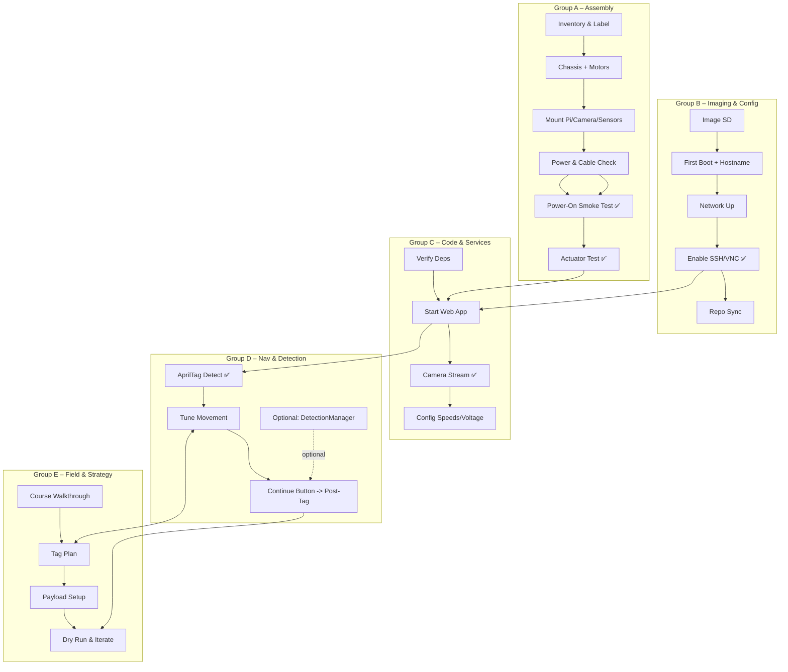

# PathfinderBot — Parallel Task Flow (Draft)

This draft replaces fixed **roles** with **parallel task groups** and explicit **dependencies**, so anyone can pick up tasks based on interest and comfort level. The goal is to keep teams moving without bottlenecks while making prerequisites obvious.

## How to use this
- Treat each **Task Group (A–E)** as a swimlane that can run in parallel when dependencies are met.
- Within a group, tasks are listed in likely order; however, feel free to reorder if you know what you’re doing.
- Use the **Mermaid diagrams** below for a quick visual of what can run concurrently and what must come first.

> **Legend**
> - 🔑 = prerequisite/dependency
> - ✅ = verification check
> - ⏱ = suggested timebox (adjust live based on team progress)

---

## High-Level Flow
1. **Kickoff & Planning** (short): Align on goals, assign initial tasks by interest—not titles.
2. **Run Parallel Tracks** (A–E below), converging at key checkpoints.
3. **Integrate, Verify, Iterate**, and move to the challenge.

---

## Task Groups (Parallel Swimlanes)

### Group A — Robot Assembly & Hardware Verification
- A1. Inventory kit, label parts (⏱ 5–10m)
- A2. Chassis build, motors, motor driver (⏱ 30–45m)
- A3. Mount Pi, camera, sonar, LEDs, buzzer (⏱ 20–30m)
- A4. Cable sanity check: polarity, servo leads, power to **correct** port (🔑 for power-up)
- A5. ✅ **Power-on smoke test** (voltage OK, no overheating)
- A6. ✅ **Actuator test**: wheels fwd/back/strafe, LEDs, buzzer

### Group B — Pi Imaging & Base Config
- B1. Image SD (prebuilt image preferred) (⏱ 10–15m)
- B2. First boot, expand FS, set hostname (⏱ 10m)
- B3. Wi‑Fi/Ethernet connectivity (⏱ 5–10m)
- B4. Enable SSH/VNC, confirm reachability from Pi 500 (🔑 for remote control)
- B5. Pull `PathfinderBot` repo or **sync `/home/robot/code`** (⏱ 5–10m)

### Group C — Code & Services
- C1. Install/verify Python deps (OpenCV, Flask, pupil_apriltags, etc.) (⏱ 10–15m)
- C2. Start web control app; confirm endpoints respond (⏱ 5–10m)
- C3. Camera stream check; FPS acceptable (✅)
- C4. Add env config (speeds, voltage thresholds) (⏱ 5m)

### Group D — Navigation & Detection
- D1. AprilTag detection sanity test (calibration, tag size) (✅)
- D2. Tune PID / movement gains for stop-at-tag behavior (⏱ 10–15m)
- D3. (Optional) Wire in **DetectionManager** to switch modes (tags / objects / color) (⏱ 15–20m)
- D4. Implement **Continue** button for post-tag behaviors (pick/place) (⏱ 10m)

### Group E — Field & Game Strategy
- E1. Course walk-through; define success criteria & scoring (⏱ 10m)
- E2. Tag placement plan (IDs, spacing, heights) (⏱ 10m)
- E3. Robot setup for payload (block carrier, approach path) (⏱ 10–20m)
- E4. Dry run & iteration loop (✅)

---

## Key Dependencies (at a glance)
- A4 → A5 (power wiring must be sane before power-on)
- B4 → C2 (remote control requires SSH/VNC configured)
- C2 → D1 (camera/detector relies on app/services running)
- A6 ∧ C2 → Integration drive tests
- D1 → D2 → D4 (tag detect → tuned movement → continue behavior)
- E2 ↔ D2 (field design influences movement tuning, and vice versa)

---

## Checkpoints (Team Syncs)
- **Checkpoint 1:** Power-on + remote reachable (A5, B4) → green light to start code/services (C2)
- **Checkpoint 2:** Camera + web app + basic drive verified (A6, C3) → start AprilTag tuning (D2)
- **Checkpoint 3:** End-to-end run: navigate-to-tag → continue action (D4) → iterate with game plan (E1–E4)

---

## Visual 1 — Dependency Flow (Mermaid)

---

## Visual 2 — Gantt View (Parallel Tracks)

```mermaid
gantt
    title PathfinderBot Parallel Tracks (Draft)
    dateFormat  HH:mm
    axisFormat  %H:%M
    section Kickoff
    Align on goals & task picks         :done,    k1, 00:00, 00:10
    section Group A – Assembly
    Inventory & chassis                  :active,  a1, 00:10, 00:45
    Mount Pi/camera/sensors              :         a2, 00:30, 00:25
    Power/cable check & smoke test       :         a3, 00:55, 00:15
    Actuator test                        :         a4, 01:10, 00:10
    section Group B – Imaging & Config
    Image SD & first boot                :active,  b1, 00:10, 00:25
    Network + SSH/VNC                    :         b2, 00:35, 00:15
    Repo sync                            :         b3, 00:50, 00:10
    section Group C – Code & Services
    Verify deps                          :         c1, 00:30, 00:15
    Start web app + camera               :         c2, 00:45, 00:25
    section Group D – Nav & Detection
    Tag detect + tune movement           :         d1, 01:10, 00:30
    Continue button                      :         d2, 01:40, 00:15
    section Group E – Field & Strategy
    Course walk + tag plan               :active,  e1, 00:10, 00:25
    Payload & dry runs                   :         e2, 00:35, 00:40
```

---

## Optional: Task Picks Matrix (RACI‑lite)
Use this quick table to **self-assign** without titles. Put initials under **P** (Primary) or **S** (Support).

| Task | P | S |
|---|---|---|
| A2 Chassis & Motors |  |  |
| A3 Mount Pi/Camera/Sensors |  |  |
| B3 Network |  |  |
| B4 SSH/VNC |  |  |
| C2 Start Web App |  |  |
| C3 Camera Stream |  |  |
| D2 Tune Movement |  |  |
| D4 Continue Button |  |  |
| E2 Tag Plan |  |  |
| E3 Payload Setup |  |  |

---

## Notes & Adaptations
- If no one is comfortable with a task, **pair up** and timebox exploration (15–20m), then ask for help.
- Encourage **mini-demos** at each checkpoint; fast feedback beats perfect code.
- Keep **UI speeds conservative** initially to avoid unresponsive controls; raise gradually after stable.

---

*Draft v0.1 — happy to tailor names, durations, and checkpoints to your final workshop agenda.*
