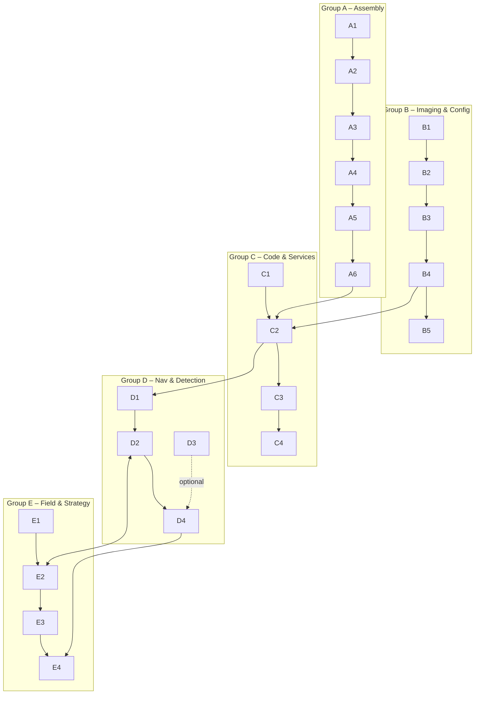

# PathfinderBot — Parallel Task Flow (Draft)

This draft replaces fixed **roles** with **parallel task groups** and explicit **dependencies**, so anyone can pick up tasks based on interest and comfort level. The goal is to keep teams moving without bottlenecks while making prerequisites obvious.

## How to use this
- Treat each **Task Group (A–E)** as a swimlane that can run in parallel when dependencies are met.
- Within a group, tasks are listed in likely order; however, feel free to reorder if you know what you’re doing.
- Use the **Mermaid diagrams** below for a quick visual of what can run concurrently and what must come first.

---

## High-Level Flow
1. **Kickoff & Planning** (short): Align on goals, assign initial tasks by interest—not titles.
2. **Run Parallel Tracks** (A–E below), converging at key checkpoints.
3. **Integrate, Verify, Iterate**, and move to the challenge.

---

## Task Groups (Parallel Swimlanes)

### Group A — Robot Assembly & Hardware Verification
- A1. Inventory kit, label parts
- A2. Chassis build, motors, motor driver
- A3. Mount Pi, camera, sonar, LEDs, buzzer
- A4. Cable sanity check
- A5. ✅ **Power-on smoke test**
- A6. ✅ **Actuator test**: wheels, LEDs, buzzer

### Group B — Pi Imaging & Base Config
- B1. Image SD (prebuilt image preferred)
- B2. First boot, expand FS, set hostname
- B3. Wi-Fi/Ethernet connectivity
- B4. Enable SSH/VNC, confirm reachability
- B5. Pull `PathfinderBot` repo or sync `/home/robot/code`

### Group C — Code & Services
- C1. Install/verify Python deps
- C2. Start web control app; confirm endpoints respond
- C3. Camera stream check
- C4. Add env config (speeds, voltage thresholds)

### Group D — Navigation & Detection
- D1. AprilTag detection sanity test
- D2. Tune movement gains for stop-at-tag behavior
- D3. (Optional) Wire in **DetectionManager**
- D4. Implement **Continue** button for post-tag behaviors

### Group E — Field & Game Strategy
- E1. Course walk-through; define success criteria & scoring
- E2. Tag placement plan (IDs, spacing, heights)
- E3. Robot setup for payload
- E4. Dry run & iteration loop

---

## Visual — Dependency Flow (Mermaid)

---

*Draft v0.2 — parallelized version without fixed roles.*
