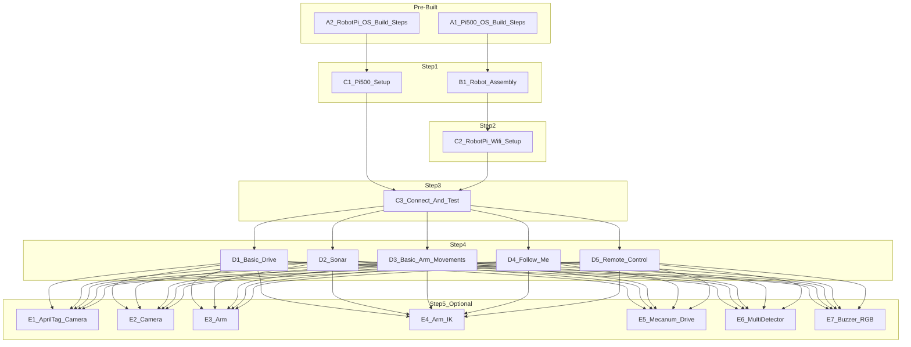

# PathfinderBot Parallel Task Flow

This document shows the sequence of tasks for the PathfinderBot workshop, with notes on which tasks can be done in parallel and which depend on others being completed.

---

## Pre-Built for Teams (Done Before Workshop)
- [A1_Pi500_OS_Build_Steps.md](https://github.com/stemoutreach/PathfinderBot/blob/main/A1_Pi500_OS_Build_Steps.md)  
- [A2_RobotPi_OS_Build_Steps.md](https://github.com/stemoutreach/PathfinderBot/blob/main/A2_RobotPi_OS_Build_Steps.md)  

> SD cards with OS builds will be provided to each team.

---

## Step 1 – Parallel Tasks
These two tasks can be done **at the same time**:  
- [B1_Robot_Assembly_Guide.md](https://github.com/stemoutreach/PathfinderBot/blob/main/B1_Robot_Assembly_Guide.md)  
- [C1_Pi500_Setup.md](https://github.com/stemoutreach/PathfinderBot/blob/main/C1_Pi500_Setup.md)  

---

## Step 2 – Networking
Depends on **B1 (Robot Assembly)**:  
- [C2_RobotPi_Wifi_Setup.md](https://github.com/stemoutreach/PathfinderBot/blob/main/C2_RobotPi_Wifi_Setup.md)  

---

## Step 3 – Connect & Test
Depends on **C1 and C2**:  
- [C3_Connect_And_Test.md](https://github.com/stemoutreach/PathfinderBot/blob/main/C3_Connect_And_Test.md)  

---

## Step 4 – Core Functions
Depends on **C3 (Connect & Test)**:  
- [D1_Basic_Drive_Guide.md](https://github.com/stemoutreach/PathfinderBot/blob/main/D1_Basic_Drive_Guide.md)  
- [D2_Sonar_Guide.md](https://github.com/stemoutreach/PathfinderBot/blob/main/D2_Sonar_Guide.md)  
- [D3_Basic_Arm_Movements_Guide.md](https://github.com/stemoutreach/PathfinderBot/blob/main/D3_Basic_Arm_Movements_Guide.md)  
- [D4_Follow_Me_Guide.md](https://github.com/stemoutreach/PathfinderBot/blob/main/D4_Follow_Me_Guide.md)  
- [D5_Remote_Control_Guide.md](https://github.com/stemoutreach/PathfinderBot/blob/main/D5_Remote_Control_Guide.md)  

---

## Step 5 – Advanced / Optional Tasks
These are **optional** and should be done **after completing Step 4 (Core Functions)**:  
- [E1_AprilTag_Camera_Guide.md](https://github.com/stemoutreach/PathfinderBot/blob/main/E1_AprilTag_Camera_Guide.md)  
- [E2_Camera_Guide.md](https://github.com/stemoutreach/PathfinderBot/blob/main/E2_Camera_Guide.md)  
- [E3_Arm_Guide.md](https://github.com/stemoutreach/PathfinderBot/blob/main/E3_Arm_Guide.md)  
- [E4_Arm_Inverse_Kinematics_Guide.md](https://github.com/stemoutreach/PathfinderBot/blob/main/E4_Arm_Inverse_Kinematics_Guide.md)  
- [E5_Mecanum_Drive_Guide.md](https://github.com/stemoutreach/PathfinderBot/blob/main/E5_Mecanum_Drive_Guide.md)  
- [E6_PathfinderBot_MultiDetector_Guide.md](https://github.com/stemoutreach/PathfinderBot/blob/main/E6_PathfinderBot_MultiDetector_Guide.md)  
- [E7_Buzzer_and_RGB_Guide.md](https://github.com/stemoutreach/PathfinderBot/blob/main/E7_Buzzer_and_RGB_Guide.md)  

---

## Visual Flow

---
