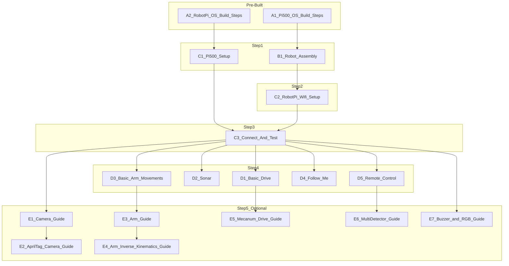

# PathfinderBot Workshop

**Empowering Engineers Through Hands-On Robotics and Leadership Development**

Welcome to the **PathfinderBot** repository! This project provides engineers and technical teams with a hands-on robotics and leadership development experience. Participants will assemble, program, and operate the **MasterPi robot**, applying both technical and strategic skills to complete challenges.

---

## Workshop Objectives

Participants will work collaboratively in teams to:

- **Develop Leadership Skills**: Practice strategic decision-making, effective communication, and collaborative problem-solving.  
- **Gain Hands-On Robotics Experience**:  
  - Assemble and configure the MasterPi robot, featuring **mecanum wheels** for omni-directional mobility, a **robotic arm with gripper**, and an integrated **camera system**.  
  - Utilize AprilTags for navigation and object interaction.  
- **Utilize the Pi500**: Operate the Raspberry Pi 500 (Pi500) as a centralized control hub for coding, debugging, monitoring, and optimizing robot performance.  
- **Collaborate in Teams**: Build, test, and compete with your robot in timed challenges.

---

## Workshop Phases

1. **Robot Assembly**  
   - Teams assemble the MasterPi robot using detailed instructions.  
   - Components include mecanum wheels, robotic arm, camera, and onboard Raspberry Pi.
   - Modify the robot to store blocks after picking them up. Use any materials to help the robot store blocks after picking them up.
     
2. **Capabilities Exploration**  
   - Test drive and explore robot features using provided Python scripts.  
   - Capabilities include mecanum drive, sonar obstacle detection, AprilTag navigation, camera streaming, and arm manipulation.
   - Pay attention to speed vs performance

3. **Course Challenge** 
   - Navigate a course with AprilTags and obstacles.  
   - Perform tasks such as block pickup and delivery.  
   - Demonstrate teamwork, problem-solving, and strategy under time constraints.
   - Build a small cource in each room to test for best robot
   - Sslect the best performaing robot from each room to move on to the finals.
     

4. **Formation Challenge**
   - STart with the [D4_Follow_Me_Guide.md](D4_Follow_Me_Guide.md)
   - Exiperiment hold an April tag in in front of the robot while in follow me mode. then move the tag around keeping it in the robot's view 
   - See how many robots can follow one leader
   - Is an infinite loop possible?

---

## Workshop Timeline

**Tuesday**
| Time     | Activity                                            |
| -------- | --------------------------------------------------- |
| 8:00 AM  | Workshop Overview                                   |
| 8:30 AM  | Team Activity Begins                                |
| 10:30 AM | Break                                               |
| 12:30 PM | Team Activity Continues                             |   
| 3:30 PM  | Pathfinder Competition Starts (7 teams 5 min each)  |
| 4:15 PM  | Follow Me Competition (all at once in main area)    |
| 4:45 PM  | Team Activity Ends                                  |

---

## System Overview: Pi500 + MasterPi

- **MasterPi robot**: Mobile robotics platform with mecanum wheels, robotic arm, onboard sensors, and camera.  
- **Raspberry Pi 500 (Pi500)**: Team’s programming and control hub.  
- **Wi-Fi Networking**: Connects Pi500 and RobotPi for SSH, VNC, and real-time monitoring.  

---

## Documentation & Guides

The repository includes a structured set of guides:

### OS Build (Pre-Built for Workshop)
- [A1_Pi500_OS_Build_Steps.md](A1_Pi500_OS_Build_Steps.md)  
- [A2_RobotPi_OS_Build_Steps.md](A2_RobotPi_OS_Build_Steps.md)  

### Setup & Assembly
- [B1_Robot_Assembly_Guide.md](B1_Robot_Assembly_Guide.md)  
- [C1_Pi500_Setup.md](C1_Pi500_Setup.md)  
- [C2_RobotPi_Wifi_Setup.md](C2_RobotPi_Wifi_Setup.md)  
- [C3_Connect_And_Test.md](C3_Connect_And_Test.md)  

### Core Functions
- [D1_Basic_Drive_Guide.md](D1_Basic_Drive_Guide.md)  
- [D2_Sonar_Guide.md](D2_Sonar_Guide.md)  
- [D3_Basic_Arm_Movements_Guide.md](D3_Basic_Arm_Movements_Guide.md)  
- [D4_Follow_Me_Guide.md](D4_Follow_Me_Guide.md)  
- [D5_Remote_Control_Guide.md](D5_Remote_Control_Guide.md)  

### Advanced / Optional
- [E1_Camera_Guide.md](E1_Camera_Guide.md)  
- [E2_AprilTag_Camera_Guide.md](E2_AprilTag_Camera_Guide.md)  
- [E3_Arm_Guide.md](E3_Arm_Guide.md)  
- [E4_Arm_Inverse_Kinematics_Guide.md](E4_Arm_Inverse_Kinematics_Guide.md)  
- [E5_Mecanum_Drive_Guide.md](E5_Mecanum_Drive_Guide.md)  
- [E6_PathfinderBot_MultiDetector_Guide.md](E6_PathfinderBot_MultiDetector_Guide.md)  
- [E7_Buzzer_and_RGB_Guide.md](E7_Buzzer_and_RGB_Guide.md)  

---

## Parallel Task Flow

To maximize efficiency, teams will complete tasks in **parallel** rather than assigning rigid roles (Builder, Programmer, Strategist).  

- **Pre-Built:** OS images (A1, A2) are preloaded on SD cards.  
- **Step 1:** Robot assembly (B1) and Pi500 setup (C1) in parallel.  
- **Step 2:** Wi-Fi setup (C2) after assembly.  
- **Step 3:** Connect & test (C3) after Pi500 and Wi-Fi setup.  
- **Step 4:** Core robot functionality (D1–D5) after connection.  
- **Step 5:** Optional features (E1–E7), each with specific dependencies.  

### Visual Flow

---

## Expected Outcomes

- Strengthen leadership, problem-solving, and technical collaboration.  
- Gain practical robotics experience using Raspberry Pi, Python, and computer vision.  
- Apply strategies in a competitive, time-constrained challenge.  

---

**PathfinderBot | STEM Outreach Initiative**  
*updated 08/17/2025*  
