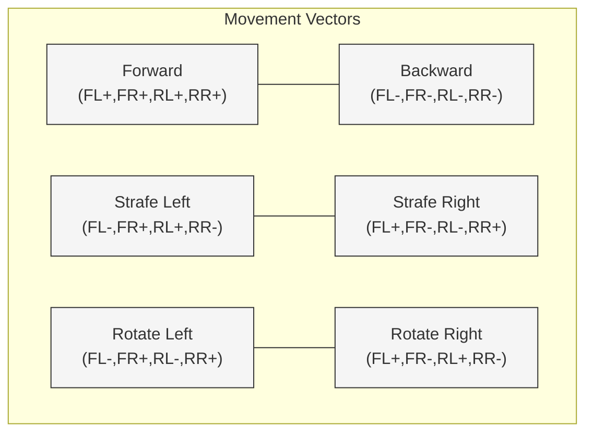

# Mecanum Wheels

Mecanum wheels enable omnidirectional movement, allowing the PathfinderBot to move forward, backward, sideways (strafing), and rotate—all without changing its orientation. This unique movement capability is ideal for navigating tight spaces and executing precise maneuvers.

---

## What Are Mecanum Wheels?

Mecanum wheels (also called Swedish or Ilon wheels) are a type of omnidirectional wheel consisting of rollers mounted at a 45-degree angle around the wheel's circumference. Each wheel’s roller orientation allows the robot to generate movement in any direction by varying the speed and direction of each wheel independently.

### Key Features:
* **Omnidirectional Movement**: Move in all directions without turning.
* **Agile Navigation**: Excellent for robotics challenges and tight spaces.
* **Independent Wheel Control**: Requires coordinated motor control for precise behavior.

---

## Movement Capabilities

By combining the motion of all four wheels, the robot can:
* **Drive forward/backward**: All wheels move in the same direction.
* **Strafe left/right**: Diagonally opposite wheels move in the same direction.
* **Rotate clockwise/counterclockwise**: Left wheels move one way, right wheels move the opposite.
* **Diagonal movement**: Combination of strafing and forward/backward movement.

---

## Control Logic for PathfinderBot

Each of the four motors is associated with a wheel:
* Front Left (FL)
* Front Right (FR)
* Rear Left (RL)
* Rear Right (RR)

Basic velocity table:

| Movement     | FL | FR | RL | RR |
| ------------ | -- | -- | -- | -- |
| Forward      | +  | +  | +  | +  |
| Backward     | -  | -  | -  | -  |
| Strafe Right | +  | -  | -  | +  |
| Strafe Left  | -  | +  | +  | -  |
| Rotate Right | +  | -  | +  | -  |
| Rotate Left  | -  | +  | -  | +  |

Note: `+` indicates forward motor rotation, `-` indicates reverse.




 

---

## Python Control Example

```python
def move_robot(forward=0, strafe=0, rotate=0):
    # Combine movement vectors
    fl_speed = forward + strafe + rotate
    fr_speed = forward - strafe - rotate
    rl_speed = forward - strafe + rotate
    rr_speed = forward + strafe - rotate

    # Normalize speeds
    max_speed = max(abs(fl_speed), abs(fr_speed), abs(rl_speed), abs(rr_speed))
    if max_speed > 1:
        fl_speed /= max_speed
        fr_speed /= max_speed
        rl_speed /= max_speed
        rr_speed /= max_speed

    # Send speeds to motor controller (example function)
    set_motor_speeds(fl_speed, fr_speed, rl_speed, rr_speed)
```

---

## Resources and Links

* **Wikipedia – Mecanum Wheel**: [https://en.wikipedia.org/wiki/Mecanum_wheel](https://en.wikipedia.org/wiki/Mecanum_wheel)
* **FTC Mecanum Physics Tutorial**: [https://gm0.org/en/latest/docs/software/tutorials/mecanum-drive.html](https://gm0.org/en/latest/docs/software/tutorials/mecanum-drive.html)
* **REV Robotics Mecanum Drivetrain Build Guide**: [https://docs.revrobotics.com/duo-build/mecanum-drivetrain-v2](https://docs.revrobotics.com/duo-build/mecanum-drivetrain-v2)

---

## Best Practices

* Ensure the rollers are mounted at 45 degrees and positioned in the correct orientation (“X” configuration).
* Calibrate motor speeds to maintain straight-line movement.
* Test all six basic motions to verify correct wiring and motor direction.

---

Mecanum wheels give your PathfinderBot unmatched maneuverability—essential for navigating AprilTag courses and completing precision tasks!
