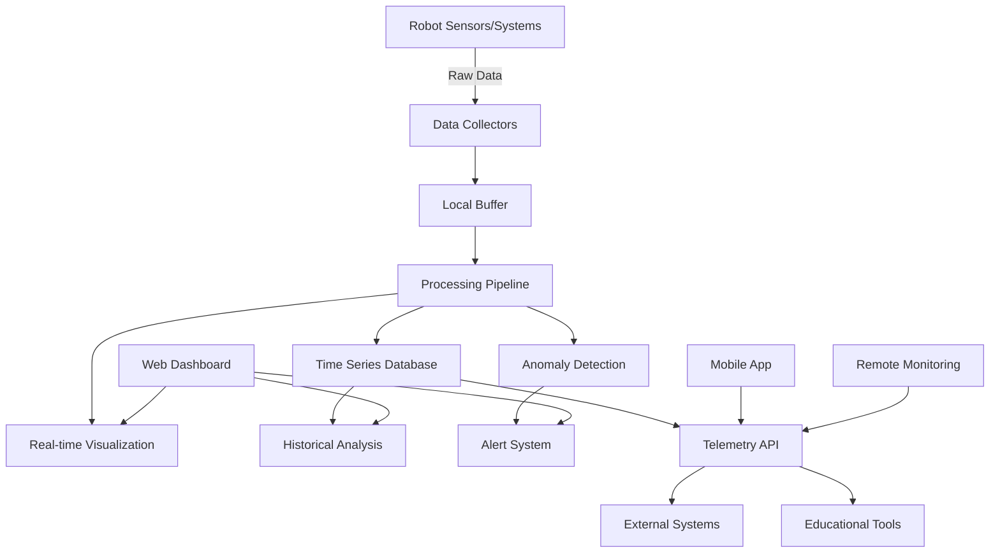
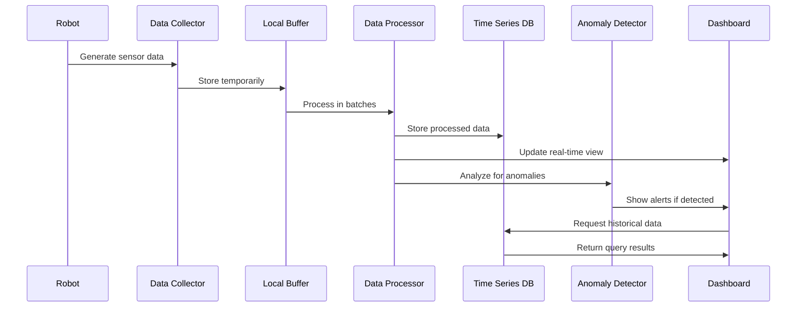

PathfinderBot Real-Time Telemetry and Monitoring PRD

## Overview

This document outlines the requirements for enhancing the real-time telemetry, monitoring, and diagnostic capabilities of the PathfinderBot platform. These improvements will provide better visibility into the robot's operation, enable predictive maintenance, facilitate debugging, and enhance the overall educational experience through interactive data visualization.

## Current State Analysis

Currently, the PathfinderBot has basic telemetry capabilities with limitations:
- Limited real-time data collection and display
- No persistent storage of operational metrics
- Basic visualization without historical trending
- No anomaly detection or alerting
- Limited remote monitoring capabilities
- No API for external telemetry consumption
- Minimal resource usage monitoring

These limitations restrict the ability to understand the robot's behavior over time, diagnose issues, and use the telemetry data as an educational tool.

## Detailed Requirements

### 1. Telemetry Collection Framework

#### 1.1 Data Collection
- Implement comprehensive sensor data collection
- Create configurable collection intervals
- Support both push and pull data collection methods
- Develop plugin architecture for custom metrics
- Implement efficient binary protocol for data transmission
- Create data buffering for offline operation
- Support selective data collection based on resource constraints

#### 1.2 Data Categories
- System metrics (CPU, memory, disk, network, temperature)
- Motion data (position, velocity, acceleration)
- Sensor readings (cameras, sonars, IMU, encoders)
- Power metrics (voltage, current, power consumption)
- Component status (motors, servos, sensors)
- Application metrics (loop timing, process statistics)
- Error and event logs

#### 1.3 Storage
- Implement time-series database for efficient storage
- Create data retention policies
- Support data compression
- Implement data partitioning
- Support external storage options
- Create backup and recovery mechanisms

### 2. Visualization System

#### 2.1 Real-time Dashboards
- Create customizable dashboard system
- Implement real-time gauges, graphs, and indicators
- Support interactive map displays
- Develop 3D visualization of robot state
- Create split-screen views for comparative analysis
- Support mobile-responsive design
- Implement widget library for custom visualizations

#### 2.2 Historical Analysis
- Create time-series trend visualization
- Implement data comparison across sessions
- Develop event correlation tools
- Create heat maps for spatial data
- Support data export in various formats
- Implement data filtering and search
- Create annotation capabilities

### 3. Anomaly Detection and Alerting

#### 3.1 Anomaly Detection
- Implement statistical anomaly detection
- Create pattern recognition for common issues
- Develop threshold-based monitoring
- Support custom detection rules
- Implement machine learning-based detection
- Create baseline profiling for normal operation
- Develop trend-based predictions

#### 3.2 Alerting System
- Create multi-level alert severity
- Implement alert routing and notification
- Support alert acknowledgment and resolution tracking
- Create alert history and reporting
- Implement alert suppression and grouping
- Develop alert escalation workflows
- Create alert visualization

### 4. Remote Monitoring

#### 4.1 Remote Access
- Create secure remote access to telemetry
- Implement role-based access control
- Support multiple simultaneous viewers
- Create mobile companion app
- Implement bandwidth-efficient operation
- Support operation through firewalls/NAT
- Create offline mode with synchronization

#### 4.2 Collaboration
- Implement shared dashboards
- Create annotation and commenting
- Support session recording and playback
- Implement screen sharing and remote assistance
- Create collaborative debugging tools
- Develop knowledge sharing integration
- Support multi-robot comparison

### 5. API and Integration

#### 5.1 Telemetry API
- Create RESTful API for telemetry access
- Implement WebSocket API for real-time data
- Support data query language
- Create SDK for common programming languages
- Implement OAuth2 authentication
- Support API rate limiting
- Create comprehensive API documentation

#### 5.2 External Integration
- Support integration with common IoT platforms
- Implement MQTT protocol support
- Create webhook capabilities
- Support data export to cloud services
- Implement integration with educational tools
- Create LMS integration for educational settings
- Support integration with simulation environments

### 6. Educational Features

#### 6.1 Data Exploration
- Create guided data exploration tools
- Implement interactive tutorials
- Develop data visualization challenges
- Create comparative experiments
- Implement hypothesis testing tools
- Support data-driven project templates
- Create case studies based on telemetry data

#### 6.2 Analysis Tools
- Implement statistical analysis tools
- Create mathematical modeling integration
- Develop physics visualization based on telemetry
- Implement data science notebooks integration
- Create machine learning playgrounds
- Support algorithm development against live data
- Implement predictive modeling tools

## Implementation Architecture



## Data Flow



## User Interface Mockups

### Main Dashboard
```
+--------------------------------------+
| PathfinderBot Telemetry              |
+-------------+------------------------+
| System      | [CPU: 23%] [MEM: 45%]  |
| Status      | [BATT: 78%] [TEMP: 32°]|
+-------------+------------------------+
|                                      |
| +----------------------------------+ |
| |                                  | |
| |      Position Tracking Map       | |
| |                                  | |
| +----------------------------------+ |
|                                      |
| +------------+       +-------------+ |
| | Motor      |       | Sensor      | |
| | Telemetry  |       | Readings    | |
| | [Graphs]   |       | [Gauges]    | |
| +------------+       +-------------+ |
|                                      |
| +----------------------------------+ |
| |                                  | |
| |    Performance History Graph     | |
| |                                  | |
| +----------------------------------+ |
+--------------------------------------+
```

### Anomaly Detection View
```
+--------------------------------------+
| Anomaly Detection                    |
+--------------------------------------+
| Detected Issues:                     |
| [!] Motor 2 current spike - 13:45:22 |
| [!] Battery voltage drop - 13:42:10  |
| [i] CPU usage above normal - Ongoing |
+--------------------------------------+
|                                      |
| +----------------------------------+ |
| |                                  | |
| |    Anomaly Timeline Visualization | |
| |                                  | |
| +----------------------------------+ |
|                                      |
| +----------------------------------+ |
| |                                  | |
| |    Correlation Analysis          | |
| |                                  | |
| +----------------------------------+ |
+--------------------------------------+
```

## Implementation Priority and Timeline

### Phase 1 (1-2 months)
- Implement basic telemetry collection framework
- Create time-series storage
- Develop initial dashboard with real-time data
- Implement system metrics collection
- Create basic anomaly detection

### Phase 2 (2-3 months)
- Enhance visualization with historical data
- Implement RESTful API
- Create mobile-responsive design
- Develop remote access capabilities
- Implement advanced sensor data collection

### Phase 3 (3-4 months)
- Implement machine learning-based anomaly detection
- Create educational tools integration
- Develop collaborative features
- Implement advanced visualization (3D, maps)
- Create mobile companion app

## Success Metrics

1. **Data Collection Performance**: Collection of at least 20 metrics with <100ms overhead
2. **Storage Efficiency**: Store 7 days of data in <500MB with 1-second resolution
3. **Visualization Responsiveness**: Dashboard updates within 100ms of data changes
4. **Anomaly Detection**: >90% accuracy in detecting common failure conditions
5. **Remote Monitoring**: Support 5+ simultaneous connections with <250ms latency
6. **API Usability**: 5+ educational integrations created within 6 months

## Educational Benefits

Enhanced telemetry will provide significant educational benefits:
- Real-time visualization of physical principles
- Data-driven experimentation and hypothesis testing
- Introduction to data analysis and visualization
- Practical examples of statistics and mathematics
- Understanding of sensor fusion and filtering
- Introduction to machine learning through anomaly detection
- Practical control systems monitoring and optimization

## Conclusion

Implementing comprehensive real-time telemetry and monitoring will transform the PathfinderBot into a powerful educational platform that not only operates effectively but also provides deep insights into its operation. This will enhance both the operational reliability of the robot and its value as a teaching tool. The system will allow students to understand the relationship between code, physical systems, and data while providing educators with powerful tools to demonstrate concepts and monitor student progress.
