# PathfinderBot Testing and Reliability Framework

This document provides an overview of the testing and reliability framework implemented for the PathfinderBot project. This framework provides robust error handling, fault tolerance, resource monitoring, telemetry collection, and debugging capabilities to ensure reliable operation of the robot.

## Table of Contents

1. [Overview](#overview)
2. [Components](#components)
3. [Error Handling](#error-handling)
4. [Fault Tolerance](#fault-tolerance)
5. [Resource Management](#resource-management)
6. [Telemetry Collection](#telemetry-collection)
7. [Debugging Tools](#debugging-tools)
8. [Testing Framework](#testing-framework)
9. [Best Practices](#best-practices)

## Overview

The Testing and Reliability framework consists of several interconnected modules that work together to provide comprehensive system reliability, monitoring, and debugging capabilities:

- **Error Handling**: Standardized error types, error registry, and recovery mechanisms
- **Fault Tolerance**: Watchdog timers to detect and recover from component failures
- **Resource Management**: System resource monitoring and threshold-based alerts
- **Telemetry Collection**: Collection, storage, and retrieval of operational metrics
- **Debugging Tools**: Runtime debugging capabilities for development and troubleshooting

These components are designed to work together to provide a robust foundation for developing, testing, and operating the PathfinderBot.

### Framework Architecture

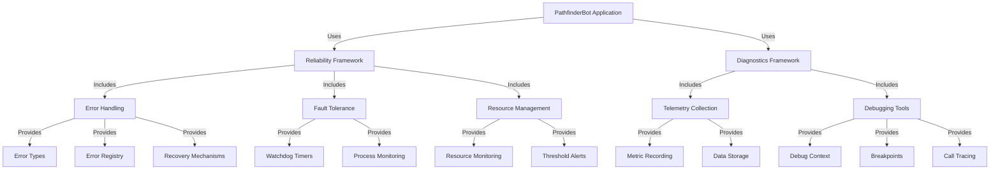

## Components

The framework is organized into the following module structure:

```
pathfinder_pkg/
├── reliability/
│   ├── error_handling/
│   │   └── errors.py
│   ├── fault_tolerance/
│   │   └── watchdog.py
│   └── resource_management/
│       └── resource_monitor.py
└── diagnostics/
    ├── telemetry/
    │   └── telemetry_collector.py
    └── debugging/
        └── debugger.py
```

## Error Handling

The error handling module provides a standardized way to create, register, and handle errors throughout the application.

### Key Features

- **Error Hierarchy**: Standardized error types for different failure categories
- **Error Registry**: Centralized error logging and tracking
- **Error Handlers**: Customizable error handling callbacks
- **Recovery Mechanisms**: Structured approach to error recovery
- **Result Handling**: Helper functions for function results with potential errors

### Error Hierarchy

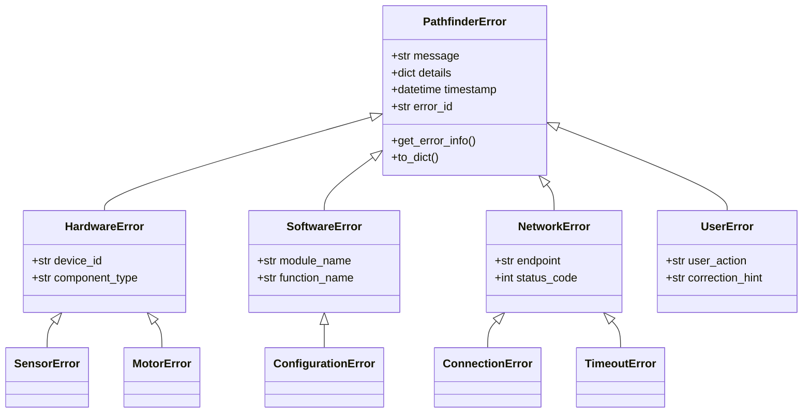

### Usage Example

```python
from pathfinder_pkg.reliability.error_handling.errors import (
    SoftwareError, register_error, register_handler
)

# Create and register an error
error = SoftwareError(
    "Failed to process sensor data",
    details={"sensor_id": "camera_01"}
)
register_error(error)

# Register an error handler
def handle_software_error(error):
    print(f"Software error detected: {error.message}")
    # Take corrective action

handler_id = register_handler(SoftwareError, handle_software_error)
```

### Error Handling Flow

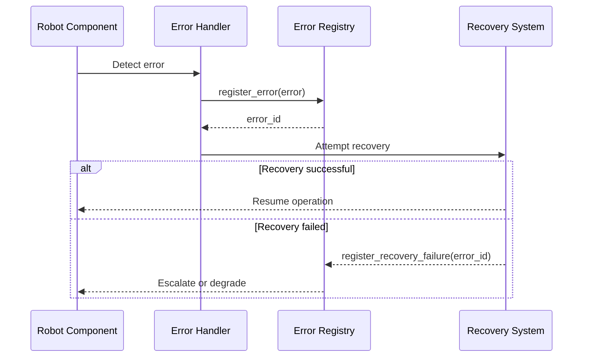

## Fault Tolerance

The fault tolerance module provides watchdog mechanisms to detect and recover from component failures.

### Key Features

- **Watchdogs**: Timers to detect component failures
- **Process Watchdogs**: Monitor and restart system processes
- **Component Watchdog Manager**: Centralized management of component watchdogs

### Watchdog Architecture

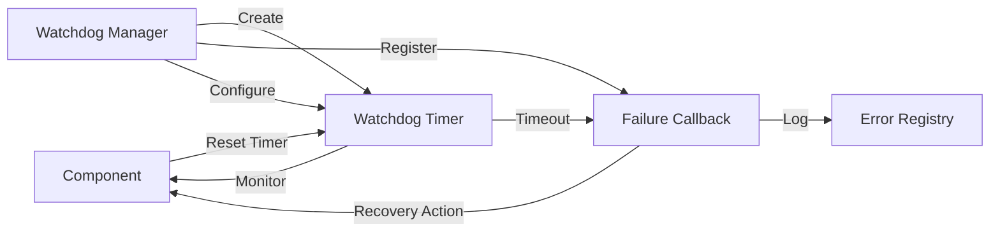

### Usage Example

```python
from pathfinder_pkg.reliability.fault_tolerance.watchdog import (
    register_component_watchdog, reset_component_watchdog
)

# Register a component watchdog
def component_failure_callback():
    print("Component failed to respond!")
    # Attempt recovery

register_component_watchdog(
    component_name="motor_controller",
    callback=component_failure_callback,
    timeout=1.0  # 1 second timeout
)

# Reset the watchdog periodically to indicate the component is healthy
def motor_controller_loop():
    while True:
        # Do motor controller operations
        # ...

        # Reset the watchdog to prevent timeout
        reset_component_watchdog("motor_controller")

        time.sleep(0.1)
```

## Resource Management

The resource management module monitors system resources and provides alerts when thresholds are exceeded.

### Key Features

- **Resource Usage Tracking**: CPU, memory, disk, and network usage monitoring
- **Threshold-Based Alerts**: Configurable thresholds for resource usage alerts
- **Resource Usage History**: Time-series data of resource usage

### Resource Monitoring System

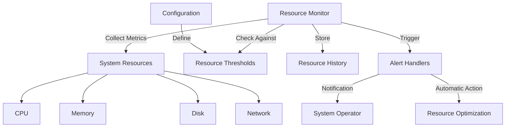

### Resource Usage Flow

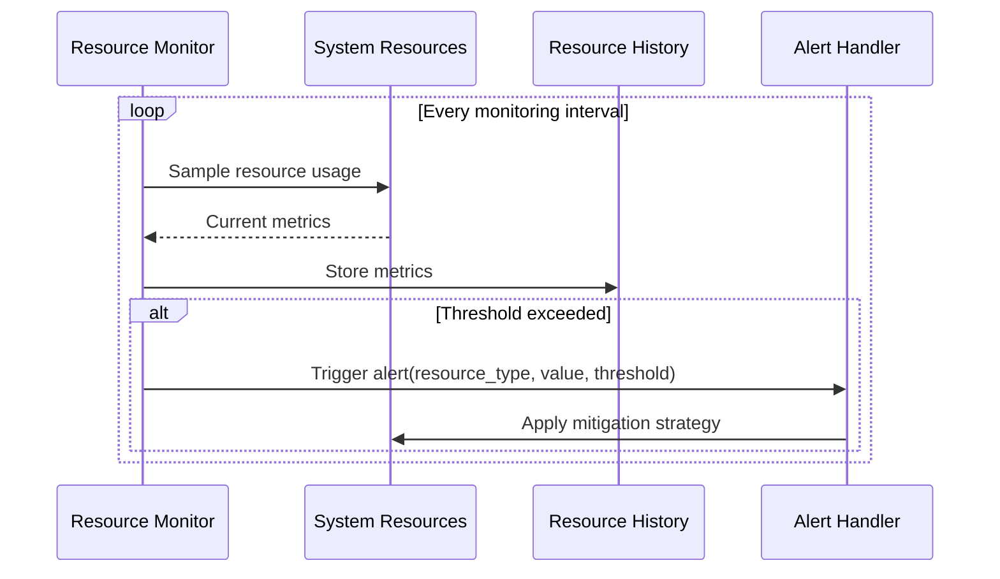

### Usage Example

```python
from pathfinder_pkg.reliability.resource_management.resource_monitor import (
    ResourceThresholds, start_resource_monitoring, register_resource_threshold_handler
)

# Define resource thresholds
thresholds = ResourceThresholds(
    cpu_percent=80.0,  # 80% CPU usage
    memory_percent=90.0,  # 90% memory usage
    disk_percent=95.0,  # 95% disk usage
)

# Define a handler for threshold violations
def threshold_handler(resource_type, usage_value, threshold):
    print(f"Resource alert: {resource_type} at {usage_value}% (threshold: {threshold}%)")
    # Take corrective action

# Register the handler
handler_id = register_resource_threshold_handler(threshold_handler)

# Start resource monitoring
start_resource_monitoring(thresholds=thresholds)
```

## Telemetry Collection

The telemetry collection module records and stores operational metrics for monitoring and analysis.

### Key Features

- **Metric Recording**: Record arbitrary named metrics with values and metadata
- **Telemetry Storage**: Multiple storage backends (memory, file, SQLite)
- **Telemetry Collectors**: Register functions to automatically collect metrics
- **Querying**: Retrieve and filter telemetry data

### Telemetry Architecture

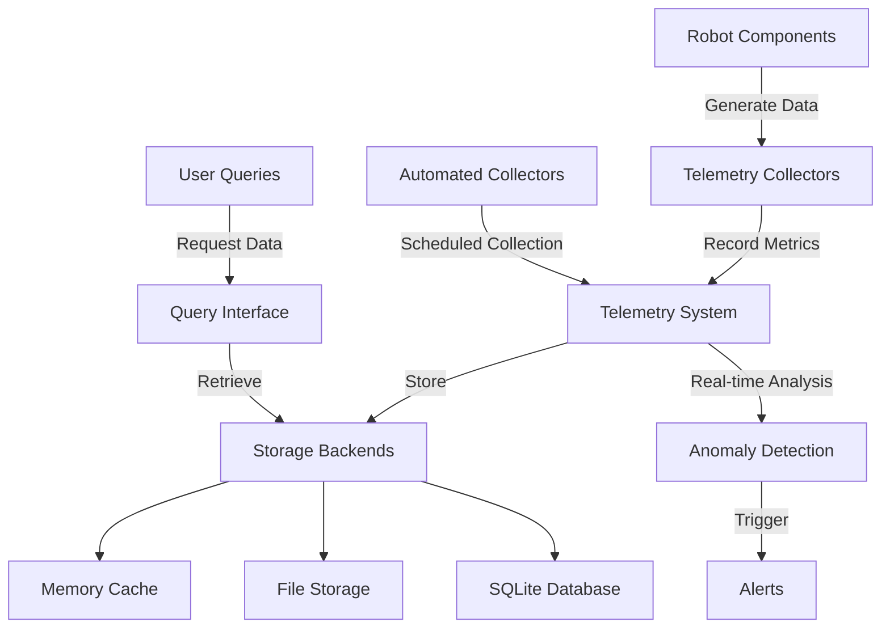

### Telemetry Flow

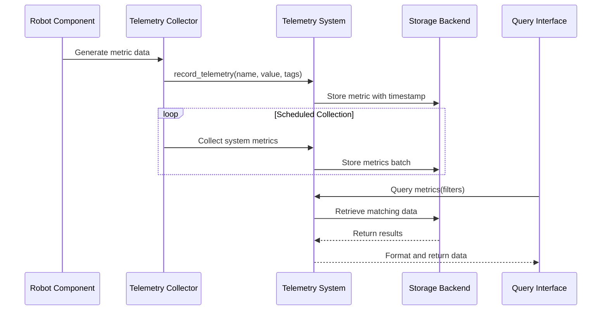

### Usage Example

```python
from pathfinder_pkg.diagnostics.telemetry.telemetry_collector import (
    start_telemetry_collection, record_telemetry, register_telemetry_collector
)

# Start telemetry collection
start_telemetry_collection()

# Record a simple metric
record_telemetry(
    metric_name="sensor.temperature",
    value=25.5,
    source="temperature_sensor_01",
    tags={"location": "front"}
)

# Register a collector function
def collect_system_metrics():
    import psutil
    return {
        "cpu_percent": psutil.cpu_percent(),
        "memory_percent": psutil.virtual_memory().percent
    }
    
register_telemetry_collector("system_metrics", collect_system_metrics)
```

## Debugging Tools

The debugging module provides tools for debugging and troubleshooting the application.

### Key Features

- **Debug Context**: Track execution time and capture variables for code blocks
- **Breakpoints**: Set and trigger breakpoints with custom callbacks
- **Call Tracing**: Trace function calls with arguments and return values
- **State Recording**: Record the state of variables over time
- **Remote Debugging**: Simple server for remote debugging capabilities

### Debugging Tools Architecture

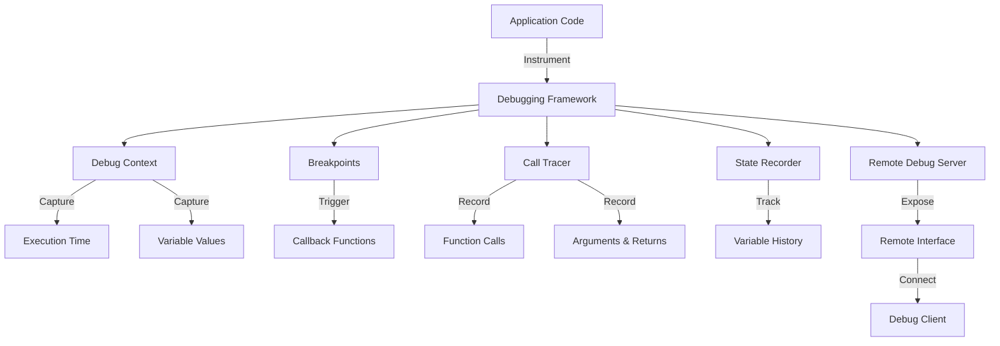

### Usage Example

```python
from pathfinder_pkg.diagnostics.debugging.debugger import (
    debug_context, set_breakpoint, call_tracer, record_state
)

# Use a debug context
with debug_context("process_sensor_data", capture_vars=True) as ctx:
    # Process sensor data
    result = process_sensor_data(sensor_data)
    
# Set and use a breakpoint
def breakpoint_callback(breakpoint):
    print(f"Breakpoint '{breakpoint.name}' triggered")
    print(f"Local variables: {breakpoint.locals_snapshot}")
    
set_breakpoint("critical_operation", callback=breakpoint_callback)

# Later, trigger the breakpoint
hit_breakpoint("critical_operation")

# Trace function calls
call_tracer.start()

@call_tracer
def my_function(x, y):
    return x + y

result = my_function(10, 20)

call_tracer.stop()

# Record variable state
for i in range(10):
    record_state("counter", i)
```

## Testing Framework

The testing framework builds on pytest and includes unit tests and integration tests for all components of the system.

### Testing Architecture

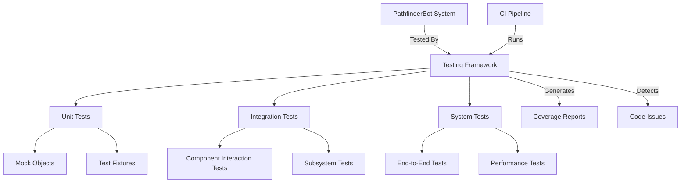

### Directory Structure

```
tests/
├── conftest.py
├── unit/
│   ├── test_error_handling.py
│   ├── test_watchdog.py
│   ├── test_resource_management.py
│   └── test_telemetry.py
└── integration/
    └── test_reliability_framework.py
```

### Test Execution Flow

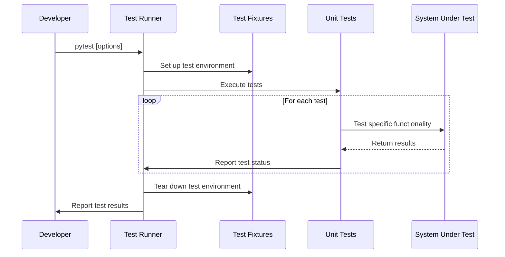

### Running Tests

To run the tests:

```bash
# Run all tests
pytest

# Run specific test file
pytest tests/unit/test_error_handling.py

# Run with verbose output
pytest -v

# Run with coverage report
pytest --cov=pathfinder_pkg
```

## Best Practices

Here are some best practices for using the Testing and Reliability framework:

### Error Handling

1. Use appropriate error types for different failure scenarios
2. Always register errors for centralized tracking
3. Include detailed context in error objects
4. Implement recovery handlers for recoverable errors

### Fault Tolerance

1. Use watchdogs for critical components
2. Set appropriate timeouts based on expected component behavior
3. Implement robust recovery strategies in watchdog callbacks
4. Ensure watchdogs are reset only when components are healthy

### Resource Management

1. Set appropriate thresholds based on system capabilities
2. Implement graceful degradation in threshold handlers
3. Monitor resource trends to detect gradual degradation

### Telemetry Collection

1. Record meaningful metrics with appropriate granularity
2. Use consistent naming conventions for metrics
3. Include relevant metadata in tags
4. Implement telemetry collectors for automated data collection

### Debugging

1. Use debug contexts for performance-critical code sections
2. Set strategic breakpoints for complex workflows
3. Use call tracing during development but disable in production
4. Record state for important variables in complex algorithms

### Testing

1. Write unit tests for all components
2. Use integration tests to verify component interactions
3. Use mocks and fixtures to isolate components during testing
4. Measure and maintain code coverage
